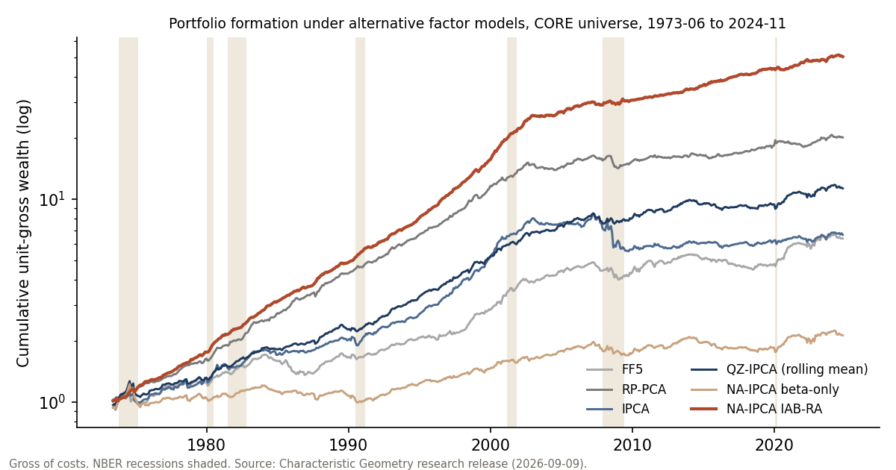

::: {.exhibit}
### Portfolio formation under alternative factor models

<div class="note">Cumulative wealth from one dollar on a unit-gross basis, CORE universe, June 1973 to November 2024 (618 months). Costs are applied as cost × one-way turnover per traded dollar, exactly as in the release's tables. Hover a line for the date and value.</div>

```{ojs}
//| echo: false
pf = FileAttachment("../data/portfolio_formation.json").json().catch(() => null)
loadFailed = pf === null ? html`<p class="note"><strong>Interactive data failed to load.</strong> The static figure below shows the gross cumulative comparison.</p>` : html``
```

```{ojs}
//| echo: false
viewof view = Inputs.radio(new Map([["Across models", "cross"], ["Beta-only vs complete IAB", "iab"], ["Ablation ladder", "ablation"]]), { value: "cross", label: "View" })
```

```{ojs}
//| echo: false
investable = pf ? pf.cross_model.models.filter((m) => m.status === "OK") : []
viewof chosen = Inputs.checkbox(investable.map((m) => m.id), {
  label: "Models", value: ["ipca", "qz_ipca", "naipca_iab"],
  format: (id) => investable.find((m) => m.id === id).label, disabled: view !== "cross"
})
viewof cost = Inputs.radio([0, 10, 50], { label: "Cost (bp per traded dollar)", value: 10, format: (x) => `${x} bp`, disabled: view === "ablation" })
viewof universe = Inputs.radio(pf ? pf.iab.universes : ["CORE"], { label: "Universe", value: "CORE", disabled: view !== "iab" })
viewof logScale = Inputs.toggle({ label: "Log scale", value: true, disabled: view === "ablation" })
viewof sample = Inputs.radio([618, 594, 206], { label: "Sample (months)", value: 618, disabled: view !== "ablation" })
```

```{ojs}
//| echo: false
months = pf ? pf.months.map(parseMonth) : []
series = {
  if (!pf) return []
  if (view === "cross") {
    return chosen.map((id) => ({ id, label: investable.find((m) => m.id === id).label,
      r: netSeries(pf.cross_model.r[id], pf.cross_model.turnover[id], cost) }))
  }
  if (view === "iab") {
    return ["beta_only", "complete"].map((leg) => ({ id: leg, label: leg === "beta_only" ? "NA-IPCA beta-only" : "NA-IPCA complete IAB",
      r: netSeries(pf.iab.r[universe][leg], pf.iab.turnover[universe][leg], cost) }))
  }
  return []
}
rows = series.flatMap((s) => wealthPath(s.r).map((w, i) => ({ date: months[i], wealth: w, label: s.label, id: s.id })))
```

```{ojs}
//| echo: false
chart = {
  if (!pf) return html``
  if (view === "ablation") {
    const data = pf.ablation.filter((d) => d.sample_months === sample)
    const order = ["intercept_off", "mean_only", "complete_iab"]
    const names = { intercept_off: "Intercept off", mean_only: "Mean only", complete_iab: "Complete IAB" }
    return Plot.plot({
      height: 260, marginLeft: 50, x: { domain: order, tickFormat: (d) => names[d], label: null },
      y: { label: "Gross Sharpe ratio", grid: true },
      marks: [
        Plot.barY(data, { x: "model", y: "gross_sharpe", fill: (d) => d.model === "complete_iab" ? palette.complete : palette.qz_ipca }),
        Plot.text(data, { x: "model", y: "gross_sharpe", text: (d) => fmt2(d.gross_sharpe), dy: -8, fontFamily: "Inter" }),
        Plot.ruleY([0])
      ]
    })
  }
  const color = { domain: series.map((s) => s.label), range: series.map((s) => palette[s.id]) }
  return Plot.plot({
    height: 360, marginLeft: 52, style: { fontFamily: "Inter" },
    x: { label: null }, y: { type: logScale ? "log" : "linear", grid: true, label: `Wealth (unit-gross, ${cost} bp)` },
    color: { ...color, legend: true },
    marks: [
      nberMarks(pf.nber),
      Plot.lineY(rows, { x: "date", y: "wealth", stroke: "label", strokeWidth: (d) => d.id === "naipca_iab" || d.id === "complete" ? 2 : 1.4 }),
      Plot.tip(rows, Plot.pointerX({ x: "date", y: "wealth", stroke: "label", title: (d) => `${d.label}\n${d.date.toISOString().slice(0, 7)} · wealth ${fmt2(d.wealth)}` }))
    ]
  })
}
```

```{ojs}
//| echo: false
table = {
  if (!pf) return html``
  if (view === "cross") {
    const t = pf.cross_model.table.filter((d) => chosen.includes(d.id))
    return html`<table><thead><tr><th>Model</th><th>Gross Sharpe</th><th>Net Sharpe (${cost} bp)</th><th>Ann. return %</th><th>Ann. vol %</th><th>Max drawdown %</th><th>Turnover</th><th>Break-even</th></tr></thead>
      <tbody>${t.map((d) => { const r = pf.cross_model.r[d.id], to = pf.cross_model.turnover[d.id]; const net = sharpe(netSeries(r, to, cost));
        return html`<tr><td>${d.label}</td><td>${fmt2(d.gross_sharpe)}</td><td>${fmt2(net)}</td><td>${fmt1(d.annual_return_pct)}</td><td>${fmt1(d.annual_vol_pct)}</td><td>${fmt1(d.max_drawdown_pct)}</td><td>${fmt2(d.turnover)}</td><td>${fmtBp(d.break_even_cost_bp)}</td></tr>` })}</tbody></table>
      <p class="note">PCA is excluded: the release records it as degenerate (near-zero gross exposure) and not investable under the production configuration.</p>`
  }
  if (view === "iab") {
    const t = pf.iab.table.filter((d) => d.universe === universe)
    const p = pf.iab.paired.filter((d) => d.universe === universe)
    return html`<table><thead><tr><th>Rule (594-month strict sample)</th><th>Gross Sharpe</th><th>Net 10 bp</th><th>Net 50 bp</th><th>Ann. return %</th><th>Max drawdown %</th><th>Turnover</th><th>Break-even</th></tr></thead>
      <tbody>${t.map((d) => html`<tr><td>${d.label}</td><td>${fmt2(d.gross_sharpe)}</td><td>${fmt2(d.net_sharpe_10bp)}</td><td>${fmt2(d.net_sharpe_50bp)}</td><td>${fmt1(d.annual_return_pct)}</td><td>${fmt1(d.max_drawdown_pct)}</td><td>${fmt2(d.turnover)}</td><td>${fmtBp(d.break_even_cost_bp)}</td></tr>`)}</tbody></table>
      <table><thead><tr><th>Paired mean difference, complete − beta-only</th><th>Months</th><th>Monthly diff</th><th>95% interval</th><th>Holm p</th></tr></thead>
      <tbody>${p.map((d) => html`<tr><td>${d.sample === "STRICT24_FULL" ? "Full strict sample" : "Recent block 2007-10 onward"}</td><td>${d.n_months}</td><td>${(d.mean_diff_monthly * 100).toFixed(2)}%</td><td>[${(d.ci_low * 100).toFixed(2)}%, ${(d.ci_high * 100).toFixed(2)}%]</td><td>${d.p_holm < 1e-4 ? "< 0.0001" : d.p_holm.toFixed(4)}</td></tr>`)}</tbody></table>
      <p class="note">Intervals come from a 12-month block bootstrap of paired monthly returns; the Sharpe difference is descriptive.</p>`
  }
  const d = pf.ablation.filter((x) => x.sample_months === sample)
  return html`<table><thead><tr><th>Input rule</th><th>Gross Sharpe</th><th>Ann. return %</th><th>Ann. vol %</th><th>Max drawdown %</th></tr></thead>
    <tbody>${d.map((x) => html`<tr><td>${x.model.replace("_", " ")}</td><td>${fmt2(x.gross_sharpe)}</td><td>${fmt1(x.annual_return_pct)}</td><td>${fmt1(x.annual_vol_pct)}</td><td>${fmt1(x.max_drawdown_pct)}</td></tr>`)}</tbody></table>
    <p class="note">Same fitted model throughout: the mean input, not the instability adjustment, explains most of the gross increment.</p>`
}
```

::: {.caveat}
From the release notes: cost curves are scaled-turnover sensitivity exhibits, not verified implementable net performance. Rolling geometry and input ablations are descriptive. The original stock panel is not redistributed; every number here is a portfolio-level aggregate from the public research release.
:::

<noscript></noscript>

<p class="provenance">Source: <em>Characteristic Geometry and Portfolio Choice</em>, research release 2026-09-09 — <code>core_monthly_unitgross_returns_source.csv</code>, <code>core_model_performance_618.csv</code>, <code>iab_ra_monthly.csv</code>, <code>beta_only_monthly.csv</code>, <code>Strict24_*.csv</code>, <code>ablation_summary.csv</code>, <code>nber_monthly.csv</code>. <a href="../data/portfolio_formation.json">Download data (JSON)</a> · <a href="../assets/img/portfolio_formation.png">Static figure (PNG)</a></p>
:::
